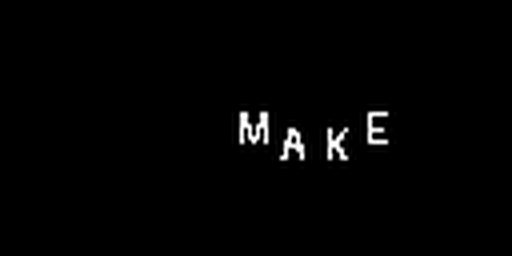

# Character-Conditioned Flow Matching for Kinetic Typography

This repository contains a small conditional flow-matching model that generates 12-frame grayscale typography videos from per-character glyph and position conditions.



## Quick start

Python 3.10 or newer is required.

```bash
python -m venv .venv
# Windows: .venv\Scripts\activate
# macOS/Linux: source .venv/bin/activate
pip install -e .
python demo.py --text "MAKE TEXT MOVE" --motion bounce
```

The last command loads the included checkpoint and writes `outputs/make_text_move.gif`. CUDA is used automatically when available; CPU also works.

## What the model does

The complete video is represented as one tensor rather than generated frame by frame. For each visible character, the condition contains:

- its canonical glyph;
- a Gaussian heatmap for its position in every frame;
- the glyph aligned to that position.

The included model supports up to eight characters per displayed word. A sentence such as `MAKE TEXT MOVE` is divided across the 12-frame clip, so the model learns both character motion and word changes.

## Method

Synthetic targets are rendered online with Pillow. A small 3D U-Net learns the velocity from Gaussian noise to a target video along the straight path

$$x_t=(1-t)x_0+t x_1, \qquad u_t=x_1-x_0.$$

At inference time, Euler integration follows the learned velocity field from noise to video. The concise derivation is in [docs/math.md](docs/math.md).

## Repository structure

```text
demo.py                 minimal inference entry point
train.py                synthetic-data training loop
evaluate.py             MSE and Dice evaluation
sample.py               inference with additional controls
src/kinetic_flow/data.py  renderer, trajectories, and conditions
src/kinetic_flow/model.py small conditional 3D U-Net
src/kinetic_flow/flow.py  flow-matching loss and Euler sampler
checkpoints/best.pt      included character-level checkpoint
docs/                   math and experiment notes
```

Suggested reading order: run `demo.py`, inspect `data.py`, read `flow.py`, then read `model.py`. `train.py` is only needed to reproduce training.

## Reproduce the main experiment

The training data is generated during loading; there is no downloaded dataset. Each sample is determined by the dataset seed and index. An [exported training example](assets/dataset_example/condition_overview.png) shows the target video, glyph channels, position heatmaps, and aligned layout used by the model.

```bash
python train.py \
  --data-mode character --frames 12 --size 64 --width 128 \
  --glyph-size 42 --max-chars 8 --base-channels 16 --batch-size 4 \
  --aligned-glyph --foreground-weight 5 --steps 10000 \
  --output outputs/character/model.pt

python evaluate.py \
  --checkpoint outputs/character/model.pt \
  --samples 8 --ode-steps 20
```

Training and sampling options are available through `python train.py --help` and `python sample.py --help`. More runs and ablations are recorded in [docs/experiments.md](docs/experiments.md).

## Results

Both models were evaluated on a fixed synthetic validation set. Dice measures overlap after thresholding the generated glyph pixels.

| Model | MSE | Dice |
| --- | ---: | ---: |
| Word-level baseline | 0.009147 | 0.785849 |
| Character-level model | **0.000022** | **0.995071** |

The character result is much stronger partly because the aligned per-character layout is a highly explicit condition. It should be read as a proof that the model can preserve supplied geometry, not as a benchmark on natural video.

## Design choices and limitations

- The checkpoint generates uppercase, grayscale, binary-looking glyphs.
- A displayed word can contain at most eight characters.
- Sentence timing is predefined rather than inferred from language.
- Motions come from four procedural trajectory families: horizontal, vertical, bounce, and circle.
- The renderer uses a single local font and the model has not been tested on real advertising footage.
- The final character model uses no extra layout guidance during sampling.

## References

- Lipman et al., [Flow Matching for Generative Modeling](https://arxiv.org/abs/2210.02747), 2022.
- Chen et al., [TextDiffuser: Diffusion Models as Text Painters](https://arxiv.org/abs/2305.10855), 2023.
